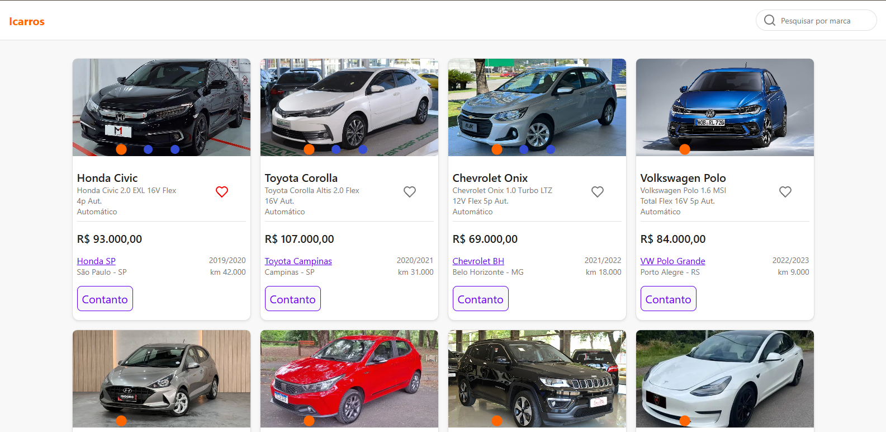
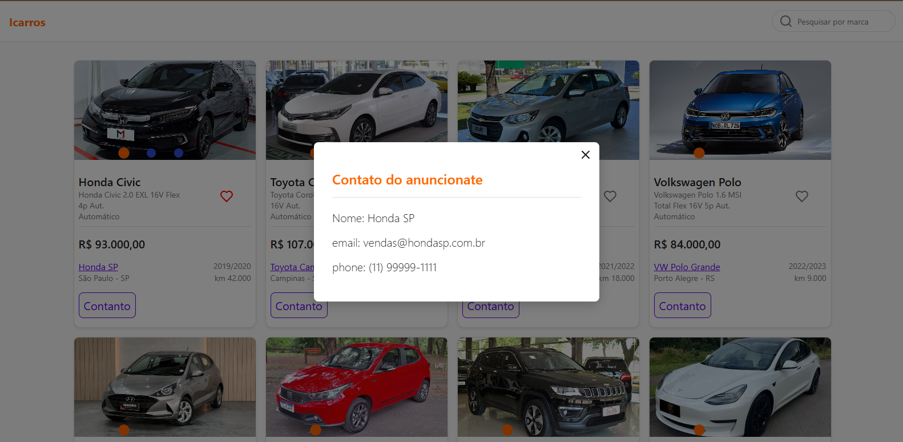

# Vehicle Listing App

Este projeto foi desenvolvido como parte de um case prático. A ideia era construir uma página React exibindo uma lista de veículos, com funções de busca, favoritos e modal de contato.

## 👩‍💻 Tecnologias Utilizadas
- React 19 (com TypeScript)
- Vite
- React Testing Library (RTL) + Jest para testes

## 🔧 Sobre o Projeto

Este app permite:
- Visualizar uma lista de veículos.
- Buscar por marca através da barra de pesquisa.
- Favoritar veículos (o ícone fica vermelho quando selecionado).
- Abrir um modal com as informações de contato do vendedor (nome, telefone e email).

Os dados são carregados a partir de um arquivo JSON local, simulando uma resposta de API.

## 📂 Estrutura de Pastas
Organizei o projeto utilizando o padrão **por features**. Segue a estrutura:

src/
│
├── assets/
│   └── (arquivos estáticos como imagens, ícones etc.)
│
├── components/
│   └── (componentes reutilizáveis da aplicação)
│
├── contexts/
│   └── (contextos globais de estado, utilizando Context API)
│
├── Models/
│   └── (tipagens e definições de modelos de dados, usando TypeScript)
│
├── styles/
│   └── (estilos globais da aplicação, como temas, variáveis e resets)
│
├── templates/
│   └── (estruturas base de páginas ou componentes de maior porte)
│
├── main.tsx
│   └── (arquivo de entrada principal da aplicação)
|
└── vite-env.d.ts
    └── (declarações de tipos para o Vite e configuração do ambiente TypeScript)

Cada funcionalidade possui sua própria pasta contendo componentes, testes e arquivos relacionados, o que melhora a manutenção e escalabilidade do projeto.

## 🖼️ Tela Principal

A interface principal ficou assim:

## 📢 Modal de Contato

O modal exibido ao clicar no botão "Contato" apresenta as informações do vendedor de forma clara e responsiva:

## 💪 Boas Práticas Adotadas
- Componentização clara.
- Padronização de código com ESLint e Prettier.
- Testes unitários para componentes chave usando RTL e Jest.
- Separacão de lógica de UI e lógica de negócio.
- Tratamento de estados vazios na busca.

## 🔍 Possíveis Melhorias Futuras
- Integração com uma API real.
- Paginação da lista de veículos.
- Filtro avançado por preço, modelo, etc.
- Melhorias no design responsivo.

## 📅 Considerações
Esse projeto foi uma ótima oportunidade para aplicar boas práticas de organização de código e arquitetura moderna em React.

Link para o código completo: **https://github.com/augusto44444/itau-test-icarros**

---

Obrigado pela avaliação! 🚀

